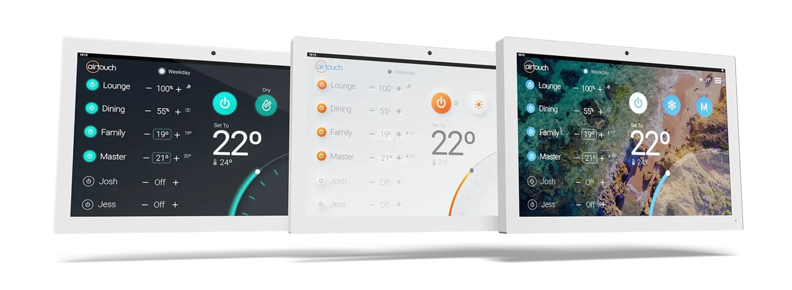
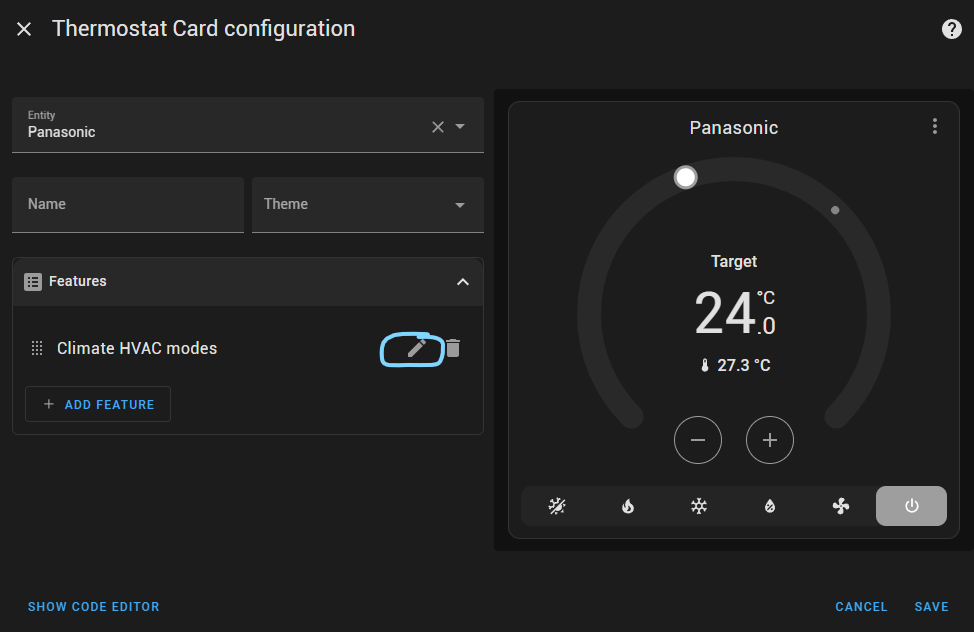
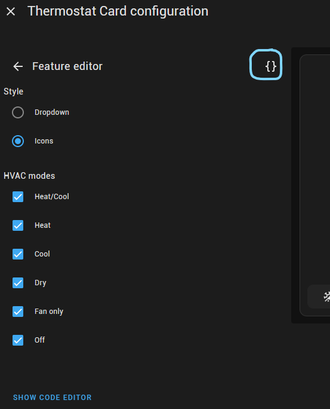
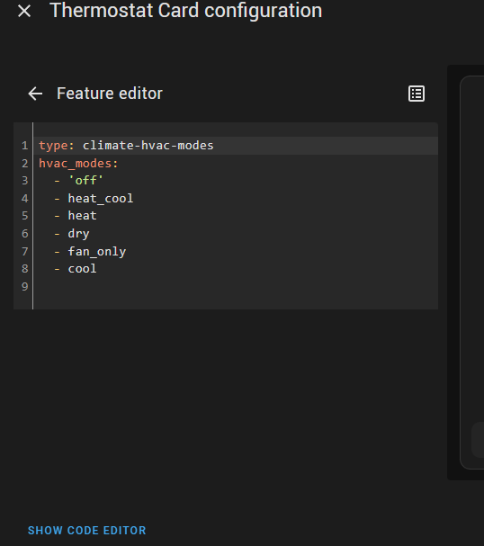

# Home Assistant - AirTouch

[![GitHub Release][releases-shield]][releases]
[![GitHub Activity][commits-shield]][commits]
[![License][license-shield]](LICENSE)

![HACS][hacs-shield]

Integration to integrate with the [Polyaire AirTouch][polyaire-airtouch] smart air conditioner controller.

Supports the AirTouch 4 and AirTouch 5.

## :computer: Installation

Click to expand installation steps...

### HACS (Preferred)
This integration can be added to Home Assistant as a [custom HACS repository](https://hacs.xyz/docs/faq/custom_repositories):
1. From the HACS page, click the 3 dots at the top right corner.
1. Select `Custom repositories`.
1. Add the URL `https://github.com/thenoctambulist/hass-airtouch`
1. Select the category `Integration`.
1. Click the ADD button.
1. Restart Home Assistant
1. In the HA UI go to "Configuration" -> "Integrations" click "+" and search for "Polyaire AirTouch"

### Manual
1. Download the latest release from [here](https://github.com/thenoctambulist/hass-airtouch/releases).
1. Create a folder called `custom_components` in the same directory as the Home Assistant `configuration.yaml`.
1. Extract the contents of the zip into folder called `airtouch` inside `custom_components`.
1. Restart Home Assistant
1. In the HA UI go to "Configuration" -> "Integrations" click "+" and search for "Polyaire AirTouch"

## :gear: Configuration
No configuration is required.
The integration will automatically discover any AirTouch systems on the network and integrate them into Home Assistant.

Have a firewall?

The following ports are used for communication between Home Assistant and the AirTouch controller.
You will need to ensure your firewall allows traffic for these ports.

 Device    | Ports 
-----------|-------
AirTouch 4 | TCP: 9004, UDP: 49004
AirTouch 5 | TCP: 9005, UDP: 49005

## :bulb: Usage
This integration adds several entities depending on the capabilities of your AirTouch system.

### :snowflake: Climate: Air Conditioner (`climate.<ac_name>`)

For each air-conditioner in the AirTouch system a [**climate**][hass-climate] entity is created.

The climate entity is be named after the air-conditioner, this is often the brand name of the air-conditioner, e.g. Panasonic of Fujitsu.

Use this entity to control the overall state of the system such as the Heating/Coolng Mode, Fan Speed etc.

#### States
 State       | Description
-------------|-------------
 `off`       | When the AC is turned off. Unlike the AirTouch app, the AC mode is not shown when it is turned off.
 `<ac_mode>` | Changing the AC mode to one of the on modes will automatically turn the AC and any `on` zones on in the selected mode.

#### Attributes
 Attribute     | Description 
---------------|-------------
 `hvac_modes`  | The available HVAC Modes for the AC.
 `fan_modes`   | The set of fan modes supported by the AC.
 `fan_mode`    | The current fan mode of the AC. It will remain in the last set fan mode even when the AC is turned off. Changing the fan mode will not turn the AC on if it is currently off.
 `temperature` | The target temperature for the AC. *Note*: If you have zones with temperature controllers, changing the target temperature will have no effect.

### :snowflake: Climate: Zone (`climate.<zone_name>`)
If you have any zones set up with a temperature sensor, a separate [**climate**][hass-climate] entity will be created for each zone.

The climate entities for the zones can be used to:
- see the current temperature of the room
- turn the zone on or off
- change the target temperature
- set the zone to turbo (if supported)

#### States
 State       | Description
-------------|-------------
 `off`       | The zone will be in the off state if: - the AC is off; or - the zone is off.
 `<ac_mode>` | If the zone is turned on the zone's state will be the same as the AC's state. Turning a zone on when the AC is off will automatically turn on the AC (and any other zone's that were left on).

#### Attributes
 Attribute     | Description 
---------------|-------------
 `hvac_modes`  | The available HVAC Modes for a zone will dynamically change based on the current AC mode. The list will always have two values: `off` and the current AC mode.
 `fan_modes`   | `on`, `off`, and `turbo` (if supported). Fan speed is controlled by the AC climate entity.
 `fan_mode`    | The fan mode will remain `on` if the zone is on even if the AC is turned off. This can be used to see which zones will be active if the AC is turned on.
 `temperature` | The target temperature for the zone. Changing the target temperature when a zone is in damper control will automatically change it back to being temperature controlled.

### :wind_face: Cover: Zone (`cover.<zone_name>_damper`)
A [**cover**][hass-cover] entity is created for all zones (whether they have) to represent the current damper state.

The cover entity for zones can be used to:
- see the current open percentage of the damper
- turn the zone on or off
- change the damper percentage (not recommended for zones with temperature sensors!)

#### States
 State    | Description 
----------|-------------
 `closed` | The zone will be in the closed state if it is turned off.
 `open`   | The zone will be in the open state if it is turned on This state is retained even if the AC is currently turned off to provide an indication of which zones will be active if the AC is turned on.

#### Attributes
 Attribute | Description 
-----------|-------------
 `current_position` | The current open percentage of the damper. 0 is closed, 100 is fully open. Changing the damper percentage when a zone is in temperature control will automatically change it to a fixed damper position. *Note:* The current open percentage reflects the AirTouch algorithm's intended position, it will not be accurate for a zone that is being used as a spill.

#### Using Zones With Thermostat Cards
If you're using the new Thermostat Card in recent versions of Home Assistant and want to enable the *Climate HVAC Modes* feature, some manual customisation is required to show the available HVAC modes correctly.

First add a thermostat card for the air-conditioner entity, then open the HVAC Climate Modes code editor as shown below. Copy the YAML that is shown, then open the same code view for the thermostat card for each zone and paste in the full list of HVAC Modes. Consider creating one zone card and then copy/pasting it for other zones.

  Step 1 | | Step 2 | | Step 3 
 --------|-|--------|-|--------
 | ![][right-arrow]|  | ![][right-arrow] | 

### :thermometer: Sensor: Temperature (`sensor.<name>_temperature`)
A temperature [**sensor**][hass-sensor] is created for the main AC and each zone with a temperature sensor.
Dedicated temperature sensors make it easy to use the current temperature in automations or view the temperature value over time in the Home Assistant history view.

These entities can safely be disabled if you are not using them.

#### States
 State     | Description
-----------|-------------
 `<value>` | The current temperature value in °C

### :large_blue_circle: Sensor: Damper Open Percentage (`sensor.<name>_damper_open_percentage`)
A [**sensor**][hass-sensor] is created for the each zone to represent the current open percentage of the damper.
A dedicated sensor entity makes it easy to display the current open percentage in entity cards or view the open perctengate over time in the Home Assistant history view.

These entities can safely be disabled if you are not using them.

#### States
 State     | Description
-----------|-------------
 `<value>` | The current damper open percentage. Range 0-100% The value will remain at the last damper position even if the zone is turned off. The damper open percentage does not take into account spill.

### :battery: Binary Sensor: Battery (`binary_sensor.<zone_name>_battery`)
A [**binary sensor**][hass-binary] is created for each zone with a temperature sensor to represent the battery state.

#### States
 State            | Description 
------------------|-------------
 `off` (`Normal`) | The temperature sensor battery is healthy.
 `on` (`Low`)     | The battery in the temperature sensor is getting low and will need to be replaced soon.

### :twisted_rightwards_arrows: Binary Sensor: Spill/Bypass (`binary_sensor.<ac/zone_name>_spill`)
A [**binary sensor**][hass-binary] is created for each air-conditioner and each zone to represent the spill or bypass state.

It's not possible to identify systems that have been set-up with a bypass damper.
If you system has a bypass damper installed, you can rename `binary_sensor.<ac_name>_spill` to `binary_sensor.<ac_name>_bypass` using the [Home Assistant UI][hass-customizing-entities].
You can disable or ignore all of the zone spill entities.

#### States
 State            | Description 
------------------|-------------
 `off` (`Closed`) | The AC is not using spill/bypass, or the zone is not active as a spill zone.
 `on` (`Open`)    | The AC is in spill/bypass, or the zone is being used as a spill zone.

## :yellow_heart: Say Thank You
If you like this integration, please :star: the repository.

If you would like to make a donation as appreciation of my work:

***
[right-arrow]: ./images/right-arrow.png

[polyaire-airtouch]: https://www.airtouch.net.au/
[commits-shield]: https://img.shields.io/github/commit-activity/y/thenoctambulist/hass-airtouch.svg
[commits]: https://github.com/thenoctambulist/hass-airtouch/commits/main
[hacs-shield]: https://img.shields.io/badge/HACS-Custom-blue.svg
[hass-binary]: https://www.home-assistant.io/integrations/binary_sensor/
[hass-climate]: https://www.home-assistant.io/integrations/climate/
[hass-cover]: https://www.home-assistant.io/integrations/cover/
[hass-customizing-entities]: https://www.home-assistant.io/docs/configuration/customizing-devices/
[hass-sensor]: https://www.home-assistant.io/integrations/sensor/
[license-shield]: https://img.shields.io/github/license/thenoctambulist/hass-airtouch.svg
[releases-shield]: https://img.shields.io/github/release/thenoctambulist/hass-airtouch.svg
[releases]: https://github.com/thenoctambulist/hass-airtouch/releases